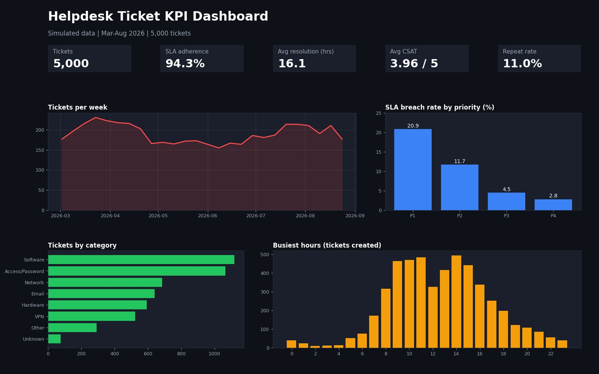
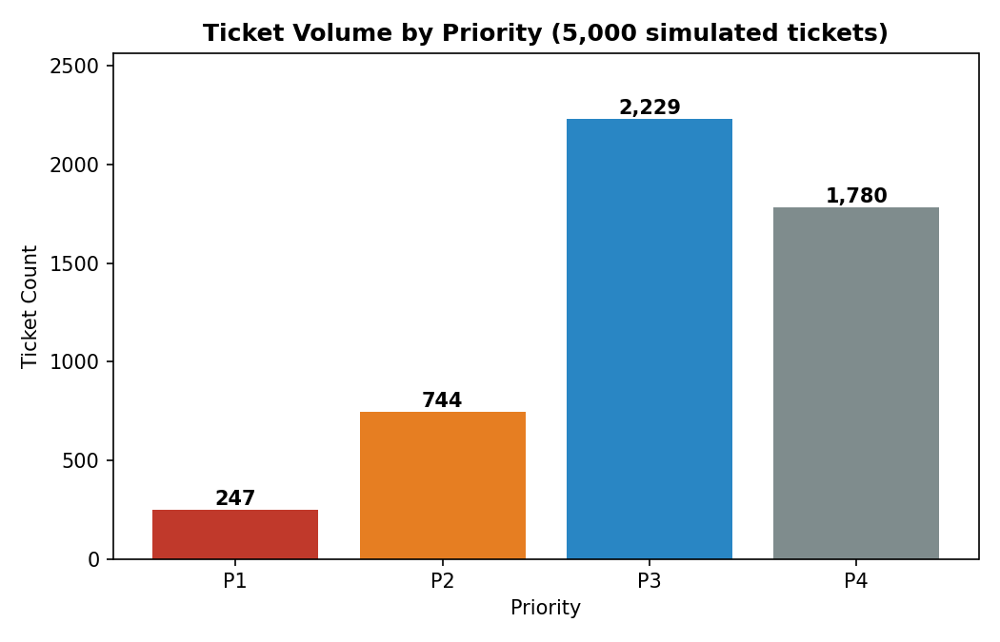

# Helpdesk Ticket KPI Dashboard

A small end-to-end analytics project: clean a messy helpdesk ticket export, calculate support KPIs with Python and SQL, and show them in an interactive dashboard.

> **Note:** The dataset is synthetic. I generated it to look like a real helpdesk export, including deliberate duplicates and missing values, so the cleaning steps are realistic.



## What this project does

1. **Raw data:** 5,100 ticket rows (March to August 2026), including 100 duplicates and some blank fields.
2. **Cleaning (Python + Pandas):** removes duplicates, fills blank category and agent, checks dates. Result: 5,000 unique tickets.
3. **KPIs:** calculated in Python and SQL.
4. **Dashboard:** Streamlit app (live) and Power BI report.

## Dataset

File: `Helpdesk_Tickets_Dataset_Raw.xlsx` (created by `generate_dataset.py`)

Columns: Ticket_ID, Created_At, Resolved_At, Priority (P1-P4), Category, Channel, Team, Agent, Status, SLA_Target_Hours, Resolution_Hours, SLA_Breach, CSAT (1-5), Is_Repeat

See `data_dictionary.md` for column definitions.

## KPIs and findings

| KPI | Result |
|---|---|
| SLA adherence | 94.3% (5.7% breached) |
| P1 SLA breach rate | 20.9%, versus 2.8% for P4 |
| Average CSAT | 3.96 / 5 |
| Repeat ticket rate | 11.0% |
| Data quality (share of raw rows without duplicate or blank issues) | 95.6% |

Main takeaway: high-priority tickets breach SLA far more often than low-priority ones, so P1 handling is the first thing to improve.



## SQL analysis

`sql_analysis.sql` contains the queries behind the KPIs: dedup with `ROW_NUMBER`, a JOIN to an SLA policy table, monthly trend with `LAG`, and agent ranking per team with `RANK`.

## How to run

```bash
pip install -r requirements.txt
python clean_tickets.py
streamlit run app.py
```

## Files

| File | Purpose |
|---|---|
| `clean_tickets.py` | Cleaning pipeline |
| `app.py` | Streamlit dashboard |
| `sql_analysis.sql` | KPI queries |
| `generate_dataset.py` | Creates the simulated dataset |
| `Helpdesk_Tickets_Dataset_Raw.xlsx` | Dataset |
| `data_dictionary.md` | Column definitions |
| `docs/` | Design notes |

## Possible extensions

- Add caching and role-based access for a multi-user setup
- Send SLA breaches to a review queue
- Connect to a real ticketing system (JIRA, ServiceNow, Zendesk)

## Author

Sajid Manzoor | Technical Support / Operations
LinkedIn: https://linkedin.com/in/sajid-manzoor-77x
