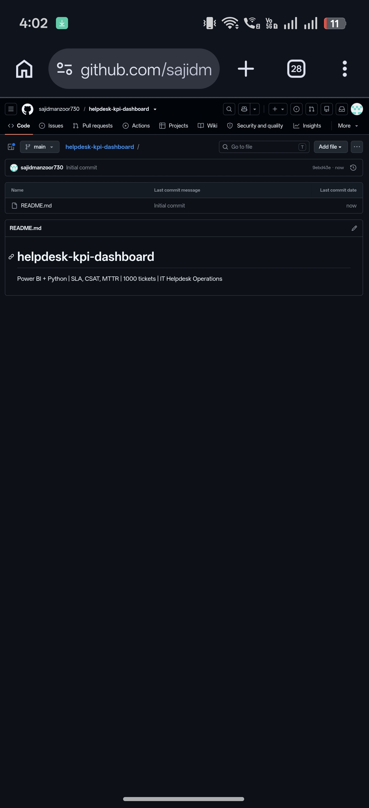

# Helpdesk Ticket KPI Dashboard

An end-to-end business intelligence demonstration for support operations: transform a realistic operational ticket export into a curated analytical dataset, validate data quality, calculate KPIs with SQL and Python, and present decision-ready reporting through Streamlit and Power BI.

> Data provenance: The dataset is synthetic demonstration data designed to resemble a normal helpdesk export. It contains no customer, employer, or confidential production records. The project demonstrates the analytics workflow, data-modeling approach, and reporting logic rather than representing employment results.

## BI solution at a glance

Source export → Python ETL → Quality Controls → Analytical Model → SQL → Power BI / Streamlit → Business Insights

## Business use case

The dashboard is designed for a support operations manager who needs a consistent view of:

- SLA adherence and breach risk
- resolution efficiency
- customer satisfaction
- repeat-ticket demand
- workload patterns
- team and agent performance
- high-priority exception queues

See bi_requirements.md for the business requirements and solution design.

## What the project demonstrates

### 1. ETL and data preparation

clean_tickets.py implements a repeatable transformation layer:

- reads the operational source export
- standardizes categorical fields
- removes duplicate Ticket_ID records
- handles controlled missing dimensions
- validates ticket chronology
- creates month, week, hour, day and SLA-variance attributes
- produces an auditable quality report

### 2. Analytical data model

The reporting design follows a dimensional structure:

- FactTickets — one row per unique ticket
- DimDate — calendar and reporting attributes
- DimAgent — agent and team attributes
- DimCategory — support category
- DimPriority — priority and SLA target attributes

See data_model.sql.

### 3. SQL analytics

sql_analysis.sql demonstrates:

- CTEs
- ROW_NUMBER for duplicate control
- JOIN to an SLA reference table
- KPI aggregations
- LAG for month-over-month analysis
- RANK for team-level performance analysis
- exception reporting for breached P1/P2 tickets

### 4. Data quality and monitoring

quality_checks.py validates:

- Ticket_ID uniqueness
- required dates
- valid priority values
- valid SLA values
- resolution-date chronology
- row-count reconciliation

The Streamlit dashboard exposes the ETL audit summary as well.

### 5. BI reporting

The reporting layer covers:

- KPI cards
- time trends
- SLA analysis
- category demand
- workload patterns
- team and agent analysis
- operational exceptions
- filterable reporting views

## Dataset

Source file: Helpdesk_Tickets_Dataset_Raw.xlsx

Period: March–August 2026

Raw rows: 5,100

Curated unique tickets: 5,000

Columns include:

Ticket_ID, Created_At, Resolved_At, Priority, Category, Channel, Team, Agent, Status, SLA_Target_Hours, Resolution_Hours, SLA_Breach, CSAT, Is_Repeat

## Headline KPIs

| KPI | Result |
|---|---:|
| SLA adherence | 94.3% |
| P1 SLA breach rate | 20.9% |
| P4 SLA breach rate | 2.8% |
| Average CSAT | 3.96 / 5 |
| Repeat-ticket rate | 11.0% |
| Raw data quality | 95.6% |

## Key operational observation

Within the demonstration dataset, P1 tickets have a substantially higher SLA-breach rate than P4 tickets. The BI solution therefore surfaces priority-level SLA analysis as an operational risk view.

## Run locally

    pip install -r requirements.txt
    python clean_tickets.py
    python quality_checks.py
    streamlit run app.py

## Repository structure

| File | Purpose |
|---|---|
| clean_tickets.py | ETL and transformation pipeline |
| quality_checks.py | Automated data-quality validation |
| data_model.sql | Dimensional analytical model |
| sql_analysis.sql | KPI and analytical SQL |
| app.py | Interactive Streamlit dashboard |
| generate_dataset.py | Creates the demonstration source dataset |
| data_dictionary.md | Field definitions |
| bi_requirements.md | Business requirements and BI solution design |
| Helpdesk_Tickets_Dataset_Raw.xlsx | Demonstration source export |
| docs/ | Supporting design notes |

## Integrity note

The project deliberately uses demonstration data so that no customer, employer, or confidential information is exposed. The numbers demonstrate the technical workflow and should not be represented as production business results.

## Author

Sajid Manzoor
